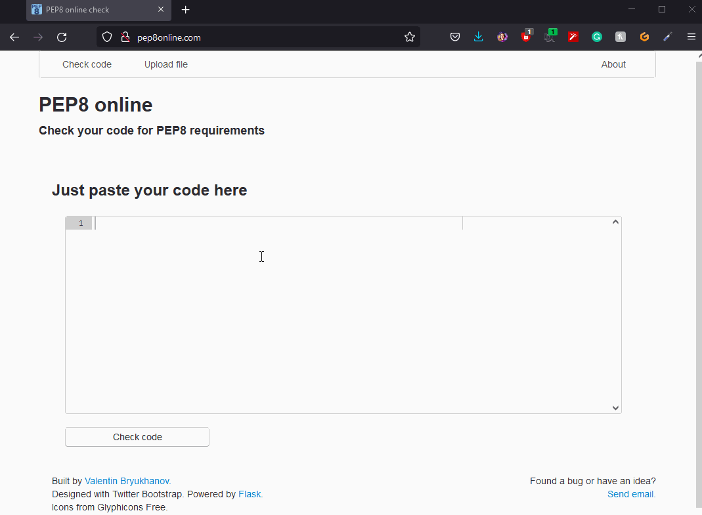

# Funny Bones

[View the live project here](https://funny-bones.herokuapp.com/)

## Table of contents
1. [Introduction](#Introduction)
2. [UX](#UX)
    1. [Ideal User Demographic](#Ideal-User-Demographic)
    2. [User Stories](#User-Stories)
    3. [Development Planes](#Development-Planes)
    4. [Design](#Design)
3. [Features](#Features)
    1. [Design Features](#Design-Features) 
    2. [Existing Features](#Existing-Features)
    3. [Features to Implement in the future](#Features-to-Implement-in-the-future)
4. [Issues and Bugs](#Issues-and-Bugs)
5. [Technologies Used](#Technologies-Used)
    1. [Main Languages Used](#Main-Languages-Used)
    3. [Frameworks, Libraries & Programs Used](#Frameworks,-Libraries-&-Programs-Used)
6. [Testing](#Testing)
    1. [Testing User Stories](#Testing-User-Stories)
    2. [Manual Testing](#Manual-Testing)
    3. [Automated Testing](#Automated-Testing) 
        - [Code Validation](#Code-Validation)
    4. [User Testing](#User-Testing)
7. [Deployment](#Deployment)
    1. [Deploying on GitHub Pages](#Deploying-on-GitHub-Pages)
8. [Credits](#Credits)
    1. [Content](#Content)
    2. [Media](#Media)
    3. [Code](#Code)
9. [Acknowledgements](#Acknowledgements)
***

## Introduction

For the Portfolio Project 3 - Python Essentials, the developer decided to build a hangman type game. Instead of a hanged man being drawn, a Halloween themed skeleton, "Funny Bones", is created when incorrect words or letters are input.

The main requirements of this project are to build a command-line application that allows the user to manage a common dataset about a particular domain.

[Back to top ⇧](#)

## UX
### Ideal User Demographic
The ideal user for this website is:
* New user
* Current user

#### New User Goals
1. As a new user, I want to see clear instructions for gameplay. 
2. As a new user, I want to see a visual representation of my remaining lives.
3. As a new user, I want the ability to replay the game.

#### Current User
1. As a current user, I want the ability to replay the game.
2. As a current user, I want the guess word to follow a certain theme.
3. As a current user, I want the choice to use different themes. 

### Development-Planes
To create a command-line application that allows the user to play a word guess game, "Funny Bones".

#### Strategy
Strategy incorporates user needs as well as product objectives. This website will focus on the following target audience, divided into three main categories:
- **Roles:**
    - New users
    - Current users

- **Demographic:**
    - All ages
    - All puzzle playing levels

- **Psychographic:**
    - Lifestyles:
        - Interest in games
        - Interest in Halloween
        - Interest in puzzles
    - Personality/Attitudes:
        - Focused
        - Forward-Thinking
        - Creative
    
The application needs to enable the **user** to:
- play the game "Funny Bones" using only alpha characters.
- generate a new word on each play-through by sourcing a random word from an external list of words.
    
With the above information in mind, a strategy table was created to show the trade-offs between what is important and what is viable with the following results.

Strategy Plane - Viability/Feasibility Table

#### Scope
The scope plane is about defining requirements based on the goals established on the strategy plane. Using the information in the strategy plane, the identified required features have been broken into the following two categories.
- Content Requirements:
    - The user will be looking for:
        - Clear and concise instructions.
        - A consistent theme, such as Halloween 
- Functionality Requirements:
    - The user will be able to:
        - Enter either a letter or a whole word if they think they know it.
        - Replay the game.
        - End the program at the end of the game.

#### Structure
The project will be deployed to a Heroku terminal. There will be no styling aside from the image of Funny Bones built using special characters within the terminal. 

#### Skeleton
A flowchart was created to show the logic the functions would follow. This flowchart was created using the flowcharts template on [Lucid](https://lucid.app/).

Lucid Flowchart

    

### Design
#### Imagery
The imagery used in the game is a skeleton named Funny Bones. The image is made using only special and alpha characters. This image was chosen to match the Halloween theme chosen for the game. The initial image was of a skeleton stood upright which turned out to be too long for the terminal window. This was substituted for a crouching skeleton, making the appearance more intimidating also.

[Back to top ⇧](#)

## Features
### Existing Features
- **Input Bar** - To progress the game, the user will use the input bar to input their next guess, either a letter or word.
- **Replay Choice** - At the end of each game, win or lose, the user will be offered the choice to play again by entering either Y (yes) or any other character to end the game.
- **Visual Representation of Lives Remaining** - Each time the user enters an incorrect guess, a section of Funny Bones the skeleton will appear. When Funny Bones is completed, the game is lost.
- **Instructions and Introduction** - At the beginning of each game, a brief introduction to Funny Bones and the instructions are shown, telling the user how to play the game.

### Features to Implement in the future
- **Additional Themes**
     - **Feature** - A set of additional themes will be available to the user to play.
     - **Reason for not featuring in this release** - A lack of experience and time prevented the developer from making this feature upon release. This feature will be developed and implemented in the future to improve repeat play by users.

[Back to top ⇧](#)

## Issues and Bugs 
The developer ran into several issues during the development of the website, with the noteworthy ones listed below, along with solutions or ideas to implement in the future.

**Skeleton Size Issue** - An issue occurred early in development when the image that was created for the visual representation of the lives with too tall. This was rectified by removing the original image and replacing it with a new image of a crouching skeleton, which also looked more intimidating. Please see the images below.

Skeleton Images

    

**Letters Not Registering In Hidden Word** - A bug was detected where the user's correct guess was not showing in the hidden word and was showing as an incorrect entry. This was fixed by defining the word_choice, hidden_word and guess variables as empty strings outside of the functions, then defining them as needed within the function.

**Game Not Choosing A New Word On Restart** - A bug was detected which caused the game to not select a new word from the list of words on restarting the game. Instead, it was in a loop of saying the user had won and would you like to play again. This was rectified by adding the defined hidden_word variable and the guessed = False variable to the while loop in the main() function.

**Previously Entered Letters Not Showing in Hidden Word** - A bug was detected when playing the game as the game would show the user a correct entry in the hidden word, then with the next correct entry the first would disappear showing only the newest entry. (eg. If the word was BAT and the user entered first B then A, the user would see B-- followed by -A-) This was rectified by moving the hidden_word variable in the while loop of the main() function underneath the word_choice variable. Thie hidden_word variable was also added outside the while loop in the main() function. This meant the code would work on the initial game and any restarts.

**Deployment Errors** - On deployment to Heroku, several issues arose. Most variables were converted from snake_case to UPPERCASE due to a pylinter error. A docstring was added to the top of the page to describe the purpose of the program. There was also an index error which was rectified by redefining the HIDDEN_WORD variable outside the functions as an empty string.

**Skeleton image would not reset on restart** - After deployment to Heroku, an error occurred which caused the skeleton image to not reset when restarting the game. The letters and words guessed in the previous game were also preventing the user from entering new letters in the new game. This was rectified by adding the TRIES, guessed_letters and guesed_words to the main function within the while loop.

[Back to top ⇧](#)

## Technologies Used
### Main Languages Used
- [HTML5](https://en.wikipedia.org/wiki/HTML5 "Link to HTML Wiki")
- [CSS3](https://en.wikipedia.org/wiki/Cascading_Style_Sheets "Link to CSS Wiki")
- [JavaScript](https://en.wikipedia.org/wiki/JavaScript "Link to JavaScript Wiki")

### Frameworks, Libraries & Programs Used
- [GitPod](https://gitpod.io/ "Link to GitPod homepage")
     - GitPod was used for writing code, committing, and then pushing to GitHub.
- [GitHub](https://github.com/ "Link to GitHub")
     - GitHub was used to store the project after pushing.
- [Lucid](https://lucid.app/ "Link to Lucid homepage")
     - Lucid was used to create a flowchart of information, making the logic of the game easily understood.
- [Am I Responsive?](http://ami.responsivedesign.is/# "Link to Am I Responsive Homepage")
     - Am I Responsive was used to generate mockup imagery of the terminal showing the game in use on Heroku.

[Back to top ⇧](#)

## Testing
### Testing User Stories

#### New User Goals:
1. As a new user, I want to see clear instructions for gameplay.
  - when the program is run, an introduction appears, telling the user how to play the game.
  
2. As a new user, I want to see a visual representation of my remaining lives.
  - On entering a wrong letter or word, a section of Funny Bones the skeleton is created. When the user has run out of tries, the skeleton will be fully formed.

3. As a new user, I want the ability to replay the game.
  - At the end of each game, regardless of the outcome, the user is given the option to enter Y to replay or N to end the game.

#### Current User
1. As a current user, I want the ability to replay the game.
  - At the end of each game, regardless of the outcome, the user is given the option to enter Y to replay or N to end the game.

2. As a current user, I want the guess word to follow a certain theme.
  - The entire game is Halloween themed, with a list of words that follow this theme. From "cemetery" to "ghouls" and plenty more besides.

3. As a current user, I want the choice to use different themes.
  - Unfortunately, this feature was not able to be implemented at this stage. 
  - In future developments, the user will have the option to input a number from a list, referencing the theme they wish to play with. This will include separate pages for each theme's code and separate lists of words to import.

[Back to top ⇧](#)

## Manual Testing

### Common Elements Testing
Manual testing was conducted on the following elements that appear in the program:
     
- Inputting a letter would tell the user if the entry is correct or incorrect. The image of the skeleton is built with every incorrect entry.

Letter Input

     
- Inputting a non-alpha character will display a message to the user telling them the character is not a valid guess.

Invalid Character Input

- Inputting a word would tell the user if the entry is correct or incorrect. The image of the skeleton is built with every incorrect entry.

Word Input

- Inputting a word that is too long or too short will display a message to the user telling them the word is not a valid guess.

Word Input Error

- The game is won when all letters in the hidden word are revealed. The user is then given the option to replay.

Win Game With Letter

- The game is won if the user correctly guesses the hidden word. The user is then given the option to replay.

Win Game With Word

- If the user runs out of tries and the skeleton becomes fully formed, the user loses the game. The user is then given the option to replay.

Lose Game

- If the user either wins or loses the game, they will be given the option to replay the game. To do this the user must enter Y in the input field.

Restart Game

- If the user either wins or loses the game, they will be given the option to replay the game. If they do not wish to replay, they can enter N or any other character in the input field.

End Program

[Back to top ⇧](#)

## Automated Testing

### Code Validation
The [PEP8 Online Checker](https://pep8online.com/) service was used to validate the code written in the word_list.py and run.py files.

**Results:**

- run file

run.py Validation results

- word_list file

word_list.py Validation results

## User testing 
My husband and the lovely people of Slack were asked to review the site and documentation to point out any bugs and/or user experience issues. Their helpful advice throughout the process led to a few small UX changes to create a better experience. 

## Deployment
### GitHub
This project was developed using [GitPod](https://www.gitpod.io/ "Link to GitPod site"), which was then committed and pushed to GitHub using the GitPod terminal. To create a GitHub repository you must:

1. Sign in to your account on Github.
2. On the top left of the home screen, click the 'New' button.
3. Under 'Repository template', select the required template from the dropdown.
4. Enter a repository name and description of your project.
5. You can select if you wish to make this project public or private.
6. There is an option of adding a README file, a .gitignore file, or choosing a license.
7. Click the 'Create Repository' button and your repository will be created.

### GitHub Forking and Cloning
To fork and clone the project, you will need to follow these steps:

1. Forking a GitHub repository.

    You might fork a project to propose changes to the upstream, or original, repository. In this case, it's good practice to regularly sync your fork with the upstream repository. To do this, you'll need to use Git on the command line. 
    - Navigate to the repository you wish to fork.
    - In the top-right corner of the page, click Fork. 

2. Cloning your forked repository.
    
    - Navigate to your forked repository.
    - Above the list of files, click 'Code'.
    - To clone the repository using HTTPS:
        - Under "Clone with HTTPS", click the copy icon (a clipboard).
    - To clone the repository using an SSH key, including a certificate issued by your organization's SSH certificate authority:
        - Click 'Use SSH', then click the copy icon. 
    - To clone a repository using GitHub CLI:
        - Click 'Use GitHub CLI', then click the copy icon.
    - Open Git Bash.
    - Change the current working directory to the location where you want the cloned directory.
    - Type git clone, and then paste the URL you copied earlier. It will look like this:
        git clone https://hostname/YOUR-USERNAME/repo-name
    - Press Enter. Your local clone will be created.

### Deploying on Heroku
To deploy this project to Heroku from its GitHub repository, the following steps were taken:

1. In your repository, type "pip freeze > requirements.txt" to create the list of dependencies to the requirements.txt file. Save, commit and push your changes to GitHub.

2. Create an account with [Heroku](https://www.heroku.com/ "Link to Heroku site"), selecting Python as the 'Primary development language'.

3. Go to your emails and click the link to verify your email address. The link will bring you to a page where you can create a password. Create a password and log in.

4. On the dashboard, click the 'create new app' button. Enter a unique name for your app and select your region. Click 'Create App'.

5. Go to the settings tab and click 'Reveal Config Vars'. Enter PORT as the KEY value and 8000 as the VALUE value.

6. Click 'Add Buildpack' and select 'Python' and 'Nodejs'. Python must be on the top of the list. Click and drag the buildpacks to the correct positions if needed.

7. Go to the deploy tab and, under 'Deployment method', click 'GitHub' and then 'Connect to GitHub'.

8. In 'Connect to GitHub', search for the repository you wish to use, then click 'Connect'.

9. If you 'Enable Automatic Deploys', Heroku will rebuild the app every time you push a change to GitHub. You can also choose to manually deploy using the 'Deploy Branch' option. Heroku will build the app and when it is finished, click the 'View' button to open the terminal.

## Credits 

The webpage [GitHub Docs - Fork a repo](https://docs.github.com/en/github-ae@latest/get-started/quickstart/fork-a-repo "Link to a GitHub Docs article on cloning and forking a repository") was used to get instructions on forking and cloning a repository. This information was used in the Deployment section of the README file.

### Code 
The developer consulted multiple sites to better understand the code they were trying to implement. The following sites were used on a more regular basis:
- [Stack Overflow](https://stackoverflow.com/ "Link to Stack Overflow page")
- [W3Schools](https://www.w3schools.com/ "Link to W3Schools page")

[Back to top ⇧](#)

## Acknowledgements

- I would like to thank my family for their valued opinions and critic during the process of design and development.
- I would like to thank my tutor, Kasia, and my mentor, Seun, for their invaluable help and guidance throughout the process.
- I would like to thank the kind and patient tutors of the tutor support system who helped when I was struggling with a piece of code, specifically John and Sheryl.
- Lastly, I would like to extend my deepest gratitude to the amazing people in Slack who helped me rigorously test every aspect of my site.

[Back to top ⇧](#) -->
